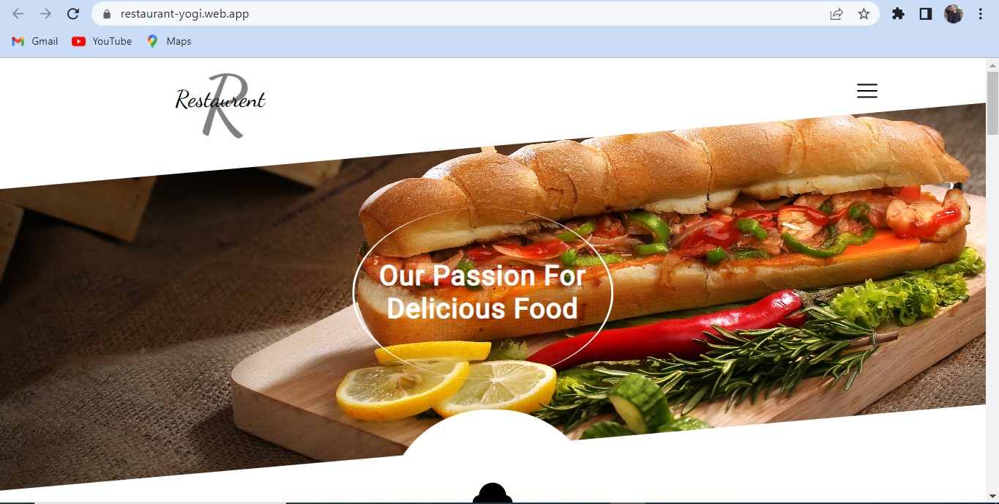
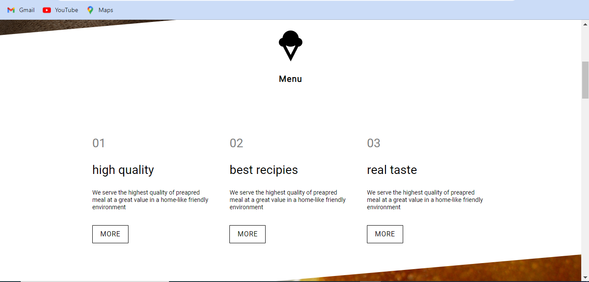
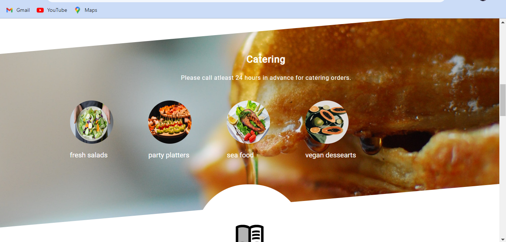
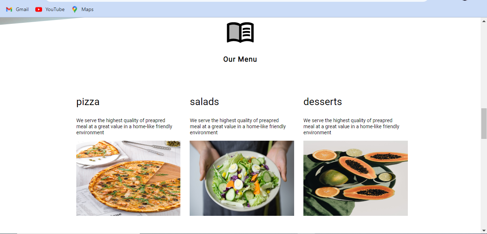
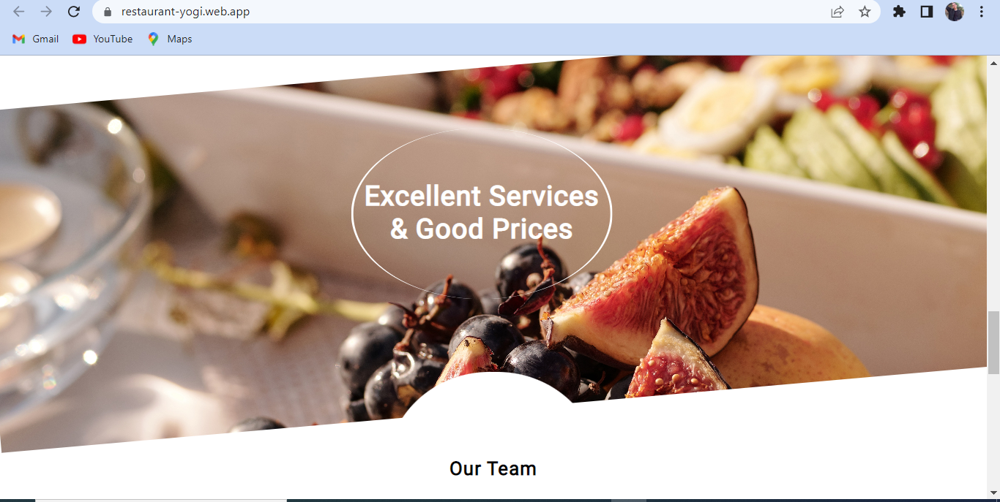
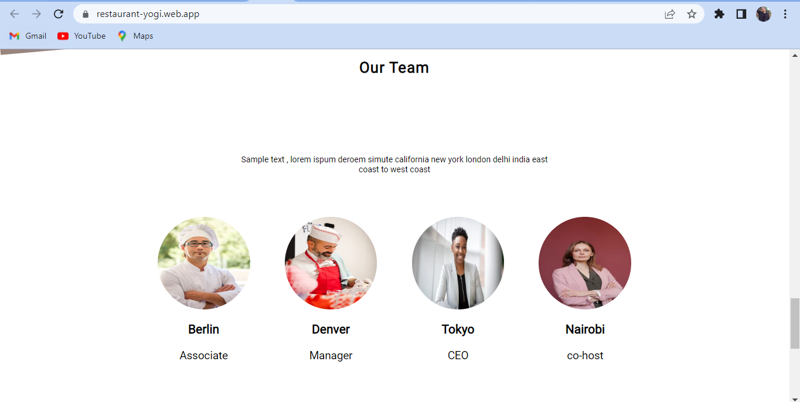
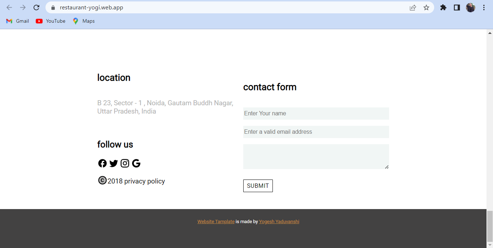

# Restaurant

The "Restaurant" project is a web-based application built using React and CSS. It is designed to showcase the menu and services offered by a restaurant, allowing users to easily browse and select items to order. The interface is clean and user-friendly, with clear navigation and visually appealing design elements. 

## Things Learned 

- Applying makeStyle CSS.
- CSS box model understanding 
- Flex and Flexbox 
- Positions and float
- Traversing to nested elements

## Skills Acquired  

- MakeStyle CSS

## _Setup Project_

Get a clone of the project from [here](https://github.com/yogesh-haryana/Restaurent.git)

## Available Scripts

In the project directory, you can run:

`npm start`

Runs the app in the development mode. Open http://localhost:3000 to view it in your browser.

The page will reload when you make changes. You may also see any lint errors in the console.

`npm test`

Launches the test runner in the interactive watch mode.

`npm run build`

Builds the app for production to the build folder. It correctly bundles React in production mode and optimizes the build for the best performance.

The build is minified and the file names include the hashes. Your app is ready to be deployed!

## Screenshots Layout

